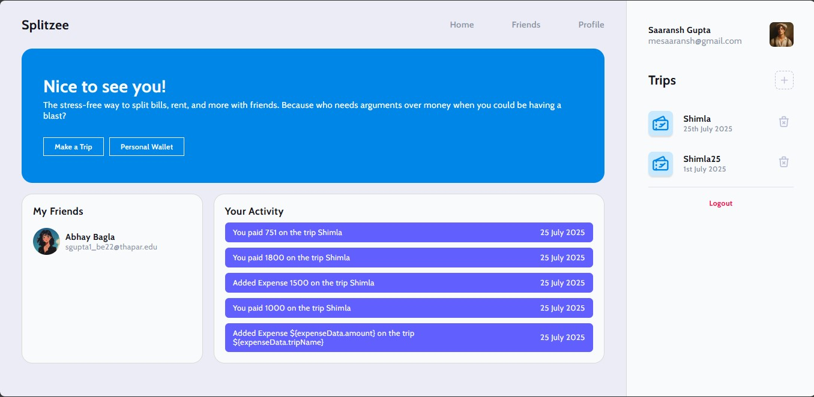
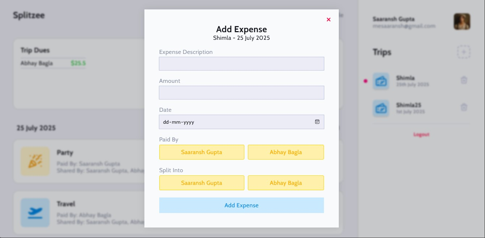
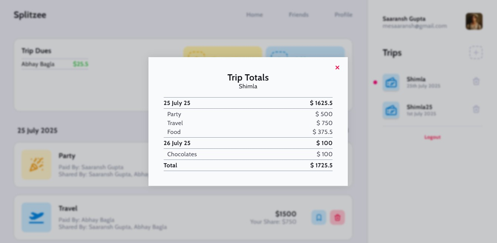
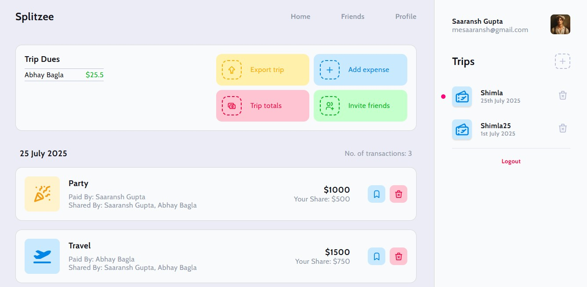
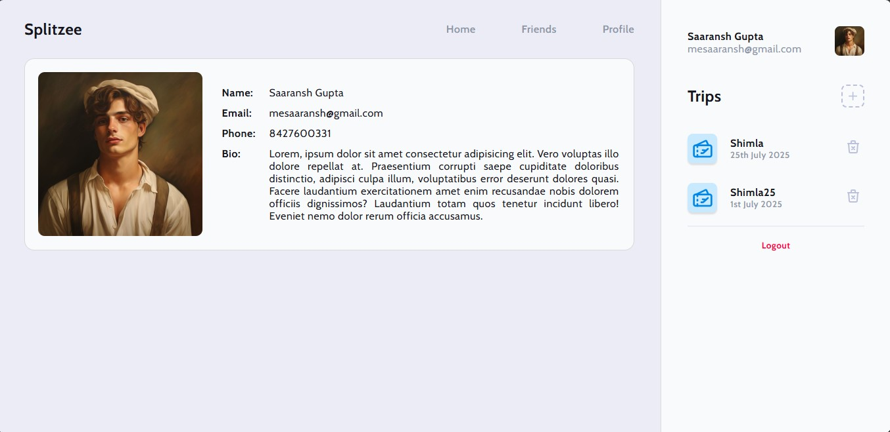
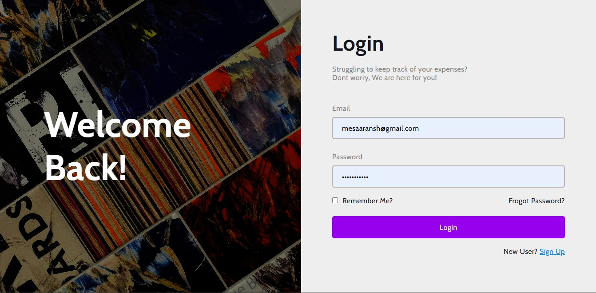

# 🌗 Splitzee
_A smarter, simpler, **free** way to split bills with friends._

---

## What is Splitzee?

**Splitzee** is a no nonsense bill-splitting app designed for friends, roommates, travel buddies, and anyone tired of chasing payments or doing mental math after dinner.  
Inspired by the simplicity of Splitwise—but without the premium paywalls—Splitzee brings transparent, real-time expense tracking and settlements into one clean, accessible space.

Whether it’s group trips, rent, takeout, or recurring costs, Splitzee makes it easy to track who owes what, and who’s still “conveniently forgetting.”

---

## Screenshots

| Dashboard | Add Expense | Settlements |
|---|---|---|
|  |  |  |
| Trip | Profile | Login |
|  |  |  |

---

## Why I Built Splitzee

I made **Splitzee** because I was fed up with “free” apps that locked basic features behind paywalls.

Splitting bills shouldn’t cost you more money, it should save you the headache.

Most alternatives were bloated or came with monthly fees just to access features like recurring bills or proper settlements. So I built a tool that’s clean, efficient, and completely free. No ads. No premium tiers. Just fairness, simplicity, and clarity.

We live in an age of digital everything yet somehow, splitting a pizza still sparks confusion. I wanted to fix that.

---

## Future Prospects

Splitzee is just getting warmed up. Here’s what’s on the roadmap:

- 🔜 Payment integrations (UPI, PayPal, etc.)
- 🔜 Mobile friendly UI (Android & iOS)
- 🔜 Chat Feature b/w friends
- 🔜 Online badges
- 🔜 Push notifications
